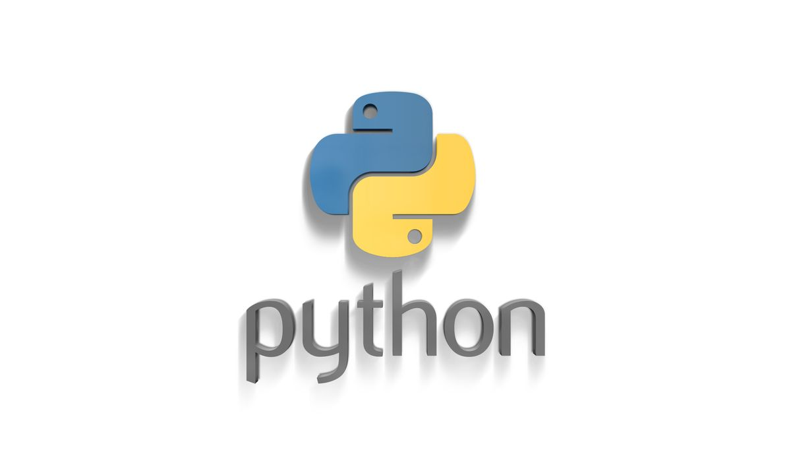
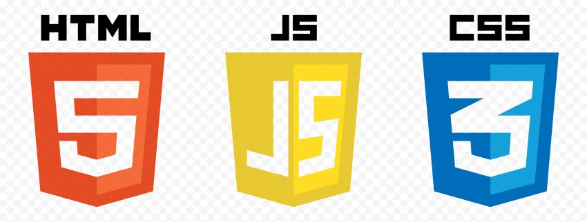

# Hello there 👋

Welcome to my GitHub profile; whether you are a recruiter or found my profile randomly or whatever it is, I hope you are impressed by my skills. If not, worry not I am always trying to improve myself.

## What I like to do

- Build web apps that are aethetically pleasing in such a way a normie doesn't need a guide to find the their way through the app. My aim is to make sure anything I build must be heavily user-friendly.
- Use the latest tech and resources at my disposal to solve my daily problems; however niche they maybe. 

## Programming Languages
  

- HTML/CSS
- JavaScript
- Java

## Tools
- Git
- GitHub
- Visual Studio Code
- PyCharm
- Intelli J
- Docker
- MySQL
- Tableau
- Work Flow Automation

## Libraries &amp; Frameworks
- React JS
- Express JS
- Fast API
- Rasa
- Pandas
- Sci-Kit
- Numpy
- Seaborn

## Projects

### Gameboxd
Gameboxd is my dream project that combines my love for games and my love for creating communal-friendly web app. GameBoxd allows you to browser any game and tag them as "Must Play" or "Played" and make custom lists. You can browse game by studios and consoles and soon rate them.

### Spam Classifier
As a good entry point into Mechine Learning, I have trained and exported 4 algorithm models, Multinomial Naive Bayes, Suppoer Vector Machine, Logistic Regression and Random Forest, which, with the help of a Fast API python script with cors middle-ware, takes sample text from a React front-end, proccess the text and send it back with confidence percentage.

### Solar Accessories
During my Bachelors in Engineering, I, along with my teammate, managed to build a protoype of a solar accessory that goes with your shirt. The idea was that, if we managed to find a way to incorporate thin strips of solar panels along the design of shirt and t-shirt, the panels could absord the solar energy throughout the day and have enough energy to charge your daily driver devices.

<!--
**johnsonnithish/johnsonnithish** is a ✨ _special_ ✨ repository because its `README.md` (this file) appears on your GitHub profile.

Here are some ideas to get you started:

- 🔭 I’m currently working on ...
- 🌱 I’m currently learning ...
- 👯 I’m looking to collaborate on ...
- 🤔 I’m looking for help with ...
- 💬 Ask me about ...
- 📫 How to reach me: ...
- 😄 Pronouns: ...
- ⚡ Fun fact: ...
-->
